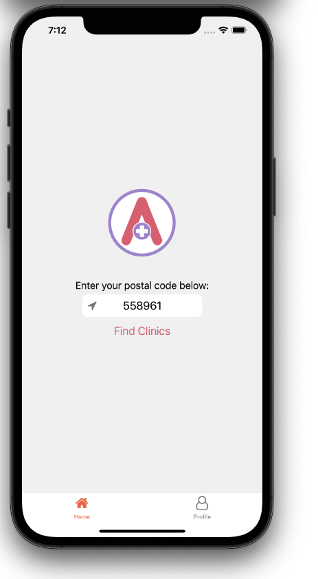
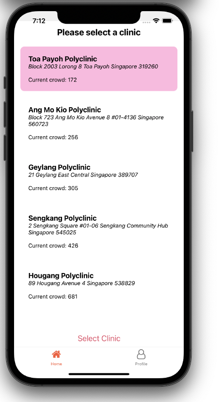
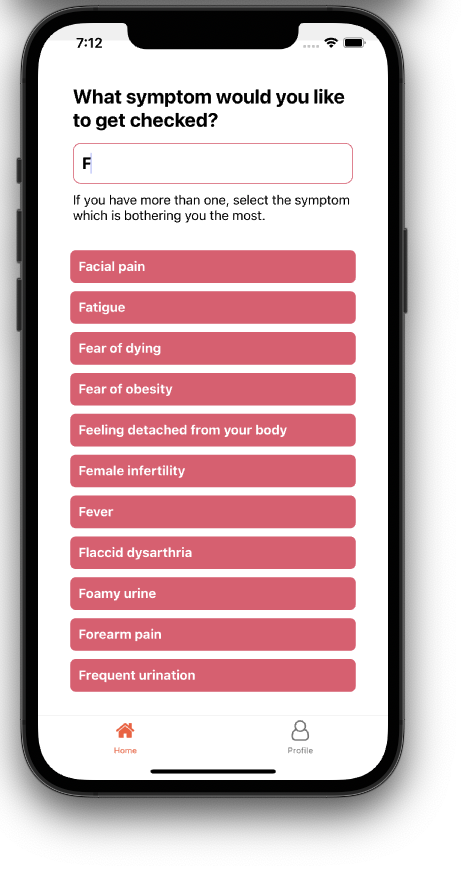
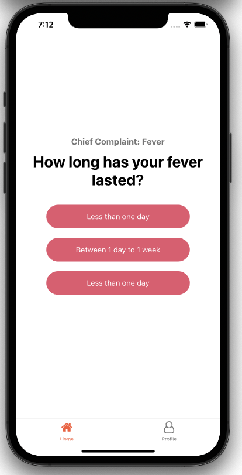
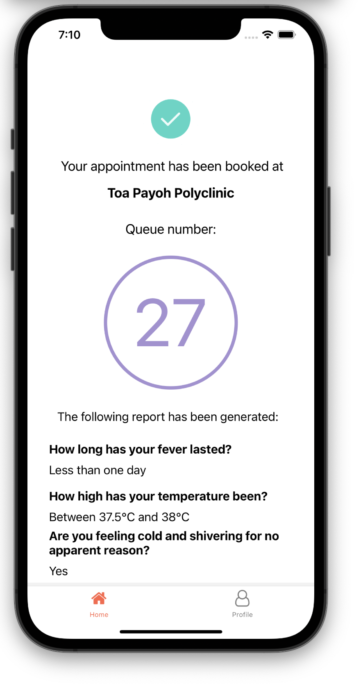
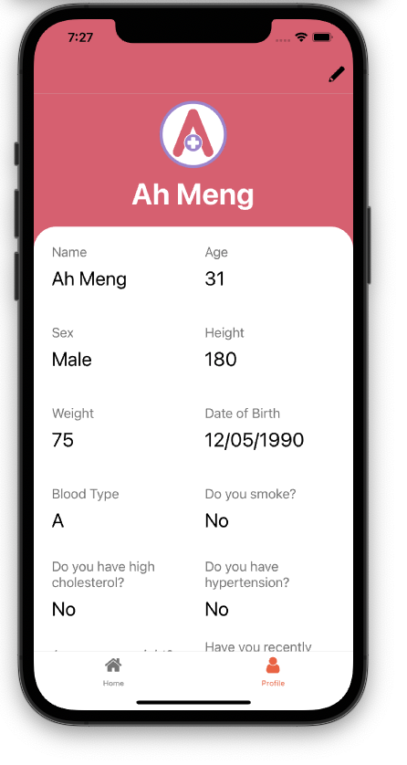

# Apollo


**Team Members:**

- Chia Tse En
- Owen Yap
- Zhou Yansheng
- Robert Wang HaoJia
- Tan Ding Jiang

## Introduction

_Apollo_ is a mobile application that aims to increase the efficiency and effectiveness of a patient's clinical visitation at times where a physical diagnosis is necessary. The application allows users to check the crowd size of nearby polyclinics, input their symptoms and possible conditions pre-consult, before booking an appointment with the polyclinic of their choice. This would reduce the crowd sizes and the total time patients spend at polyclinics, mitigating the risk of infectious disease transmissions and reducing the strain on healthcare staff.

### Problem statement

_Apollo_ was developed for the DSTA Brainhack 2021 CODE_EXP hackathon.

**The problem statement:** "How can we better adjust and adapt into New Norms in a Post-Covid world?"

Alternatives to clinic visitations have been recommended, such as telemedicine. However, there are times where telemedicine is impossible due to the need for a physical diagnosis. For such cases, physical engagements cannot be avoided which may in turn introduce risks such as the spreading of infection while patients wait in queue.

## Demo

The demo recording can be viewed [here](https://youtu.be/MGSLVzRVLVU).

### Screenshots

_These screenshots were taken on 17 Jun 2021. Updates to the dependencies may cause the appearance of Apollo to vary._













## Running the application

Do ensure that you have NodeJS, NPM and Expo installed on your workstation.

After cloning the repository, run the following line to install the dependencies:

```bash
npm install
```

Open your simulator and start the package by running:

```bash
npm start
```

## Additional Information

The online symptom checker API used has a short trial period and thus we have switched out the call to the API to a `.JSON` file in the format that would be received should the API be called.

The location API used has no usage limits but response times on the free ports are normally throttled to no more than 1 request per second for all un-authenticated users combined.
